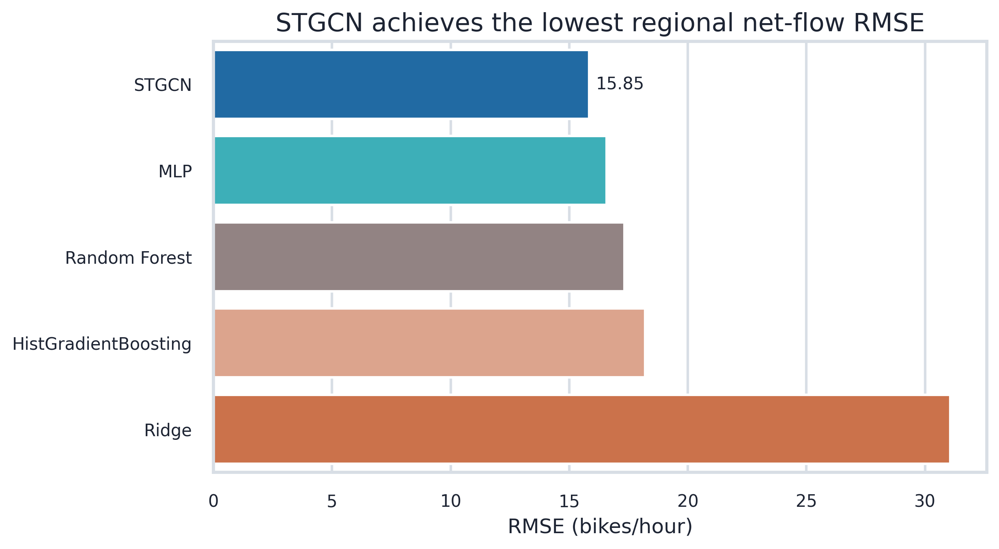
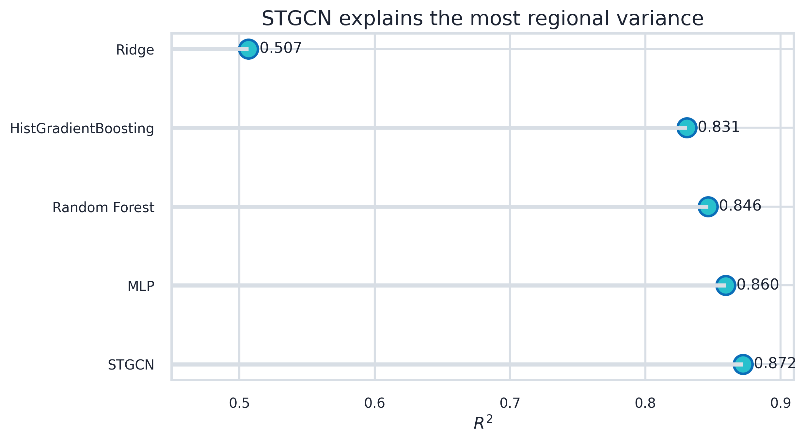
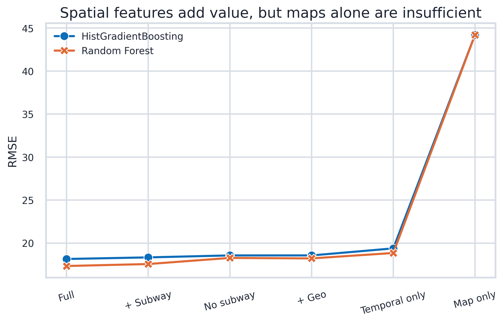
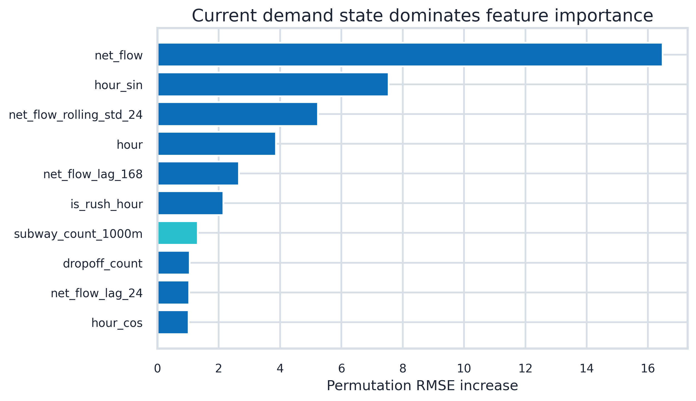
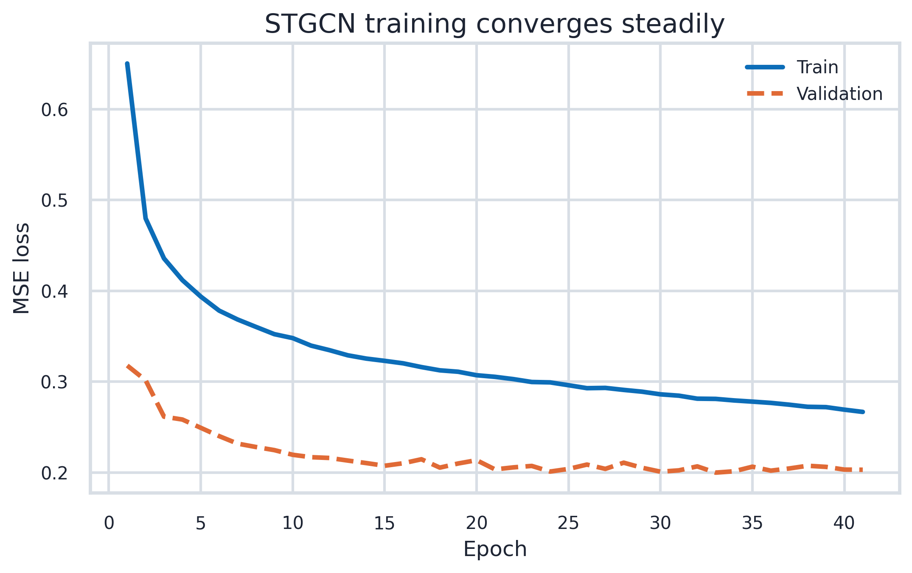
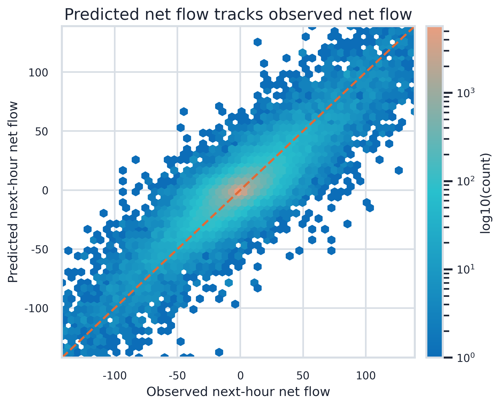
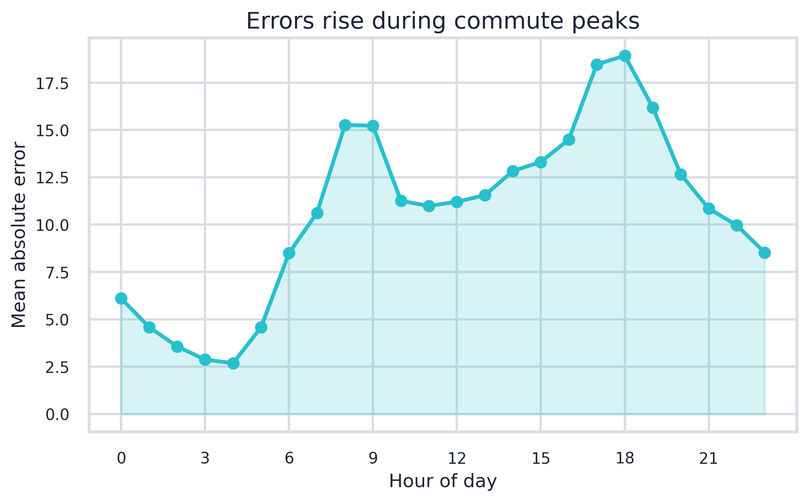
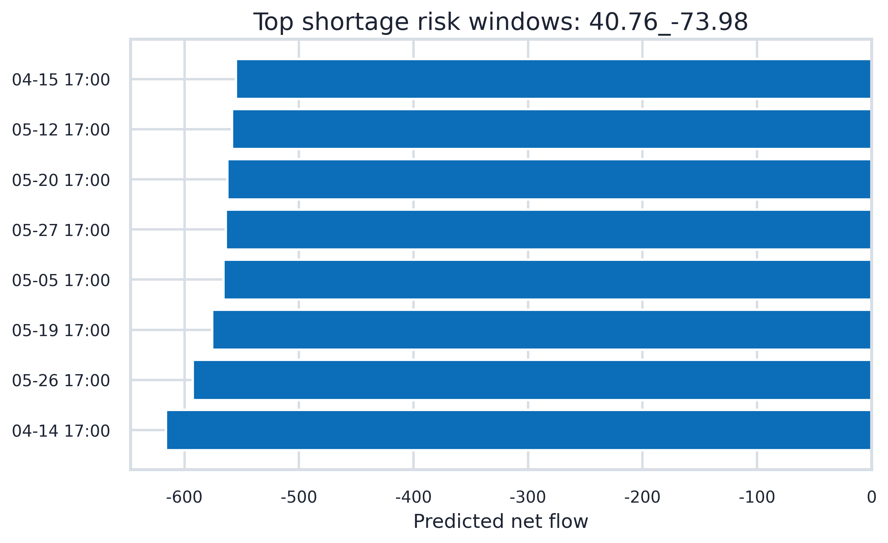
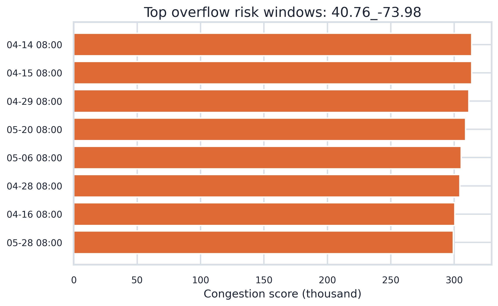
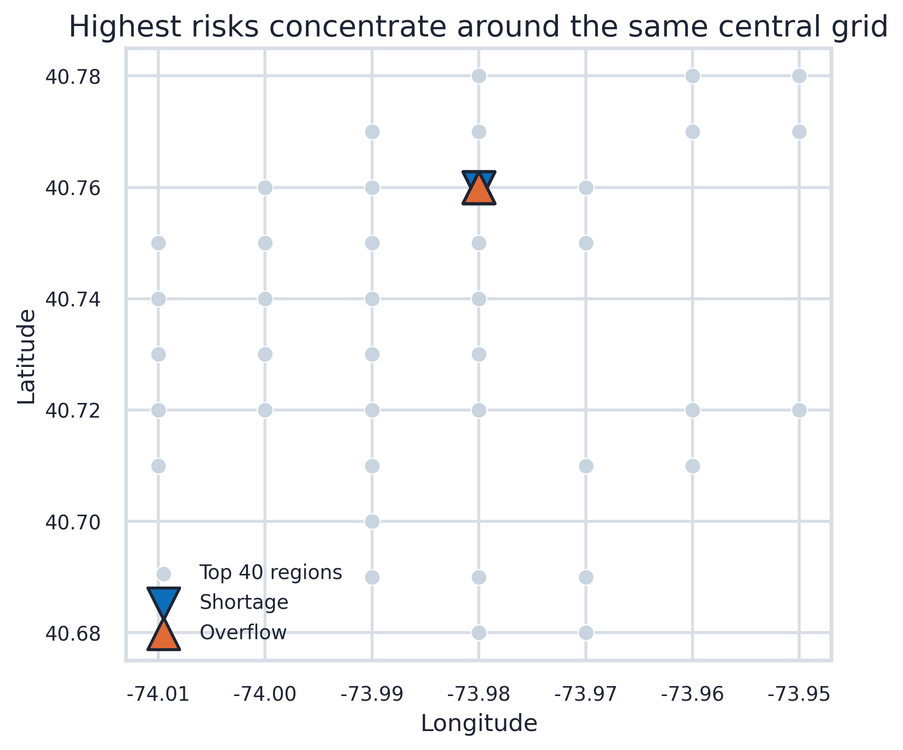

# Citi Bike 区域 STGCN 实验汇报版

> 本文件是最终保留的汇报版 Markdown。图表已按 PPT 使用场景拆成单图，不再使用 A/B/C/D 多面板标记；配色采用你提供的 5 色柱状图参考，并整体调整为科技蓝风格。

## 1. 汇报结论

- **任务升级**：从全市小时订单量预测，升级为 Top 40 区域的下一小时净流量预测；`net_flow = dropoff - pickup`，正值代表可能满桩，负值代表可能缺车。
- **模型结果**：STGCN 是本轮最优模型，RMSE = **15.847**，R² = **0.872**；相对 Random Forest 的 RMSE 降低 **8.6%**，相对 MLP 降低 **4.4%**，相对 Ridge 降低 **49.0%**。
- **空间特征判断**：完整特征组最佳 RMSE = **17.331**；去掉地铁特征后最佳 RMSE 上升 **0.940**，说明地铁特征不是主驱动，但有稳定增益；只用地图特征的 RMSE = **44.225**，不能替代时序需求状态。
- **调度落地**：最高缺车风险出现在 `2026-04-14 17:00:00` 的 `40.76_-73.98`，预测净流量 **-616.1**；最高地铁相关满桩拥堵风险出现在 `2026-04-14 08:00:00` 的 `40.76_-73.98`，拥堵分数 **313825.5**。

## 2. 数据与实验设置

| 项目 | 数值 |
|:--|:--|
| 区域数量 | 40 |
| 测试预测行数 | 52,560 |
| 测试时间范围 | 2026-04-07 06:00:00 至 2026-05-31 23:00:00 |
| 预测目标 | 下一小时区域净流量 `net_flow_next_hour` |
| 图结构 | 区域距离 kNN + 历史 OD 流量混合图 |
| STGCN 输入窗口 | 24 小时 lookback |

## 3. 模型效果

| model                |    MAE |   RMSE |    R2 |   sMAPE |
|:---------------------|-------:|-------:|------:|--------:|
| STGCN                | 10.665 | 15.847 | 0.872 | 104.767 |
| MLP                  | 11.289 | 16.577 | 0.86  | 109.867 |
| Random Forest        | 11.301 | 17.331 | 0.846 | 110.13  |
| HistGradientBoosting | 12.175 | 18.199 | 0.831 | 116.232 |
| Ridge                | 17.201 | 31.062 | 0.507 | 123.626 |

## 4. 空间特征有效性

- 完整特征组优于 `temporal_only`，RMSE 改善 **1.514**。
- 去掉地铁特征后 RMSE 变差 **0.940**，因此地铁变量有价值。
- `map_only` 的 RMSE 高达 **44.225**，说明地图特征只能补充区域差异，不能替代历史供需。

|   rank | feature                 |   importance |
|-------:|:------------------------|-------------:|
|      1 | net_flow                |       16.473 |
|      2 | hour_sin                |        7.541 |
|      3 | net_flow_rolling_std_24 |        5.236 |
|      4 | hour                    |        3.869 |
|      5 | net_flow_lag_168        |        2.66  |
|      6 | is_rush_hour            |        2.155 |
|      7 | subway_count_1000m      |        1.315 |
|      8 | dropoff_count           |        1.056 |

## 5. STGCN 诊断

## 6. 风险转化

风险定义：

- `predicted_net_flow < -threshold`：缺车风险，建议提前补车。
- `predicted_net_flow > threshold`：满桩/拥堵风险，建议提前移走车辆或预留空桩。
- 调度优先级使用 `abs(predicted_net_flow) * historical_avg_demand`，满桩拥堵分数进一步加入地铁相关拥堵指数。

## 7. PPT 图表清单

- `outputs/figures/ppt_fig_01_model_rmse.png`
- `outputs/figures/ppt_fig_02_model_r2.png`
- `outputs/figures/ppt_fig_03_feature_ablation.png`
- `outputs/figures/ppt_fig_04_feature_importance.png`
- `outputs/figures/ppt_fig_05_training_loss.png`
- `outputs/figures/ppt_fig_06_observed_predicted.png`
- `outputs/figures/ppt_fig_07_hourly_error.png`
- `outputs/figures/ppt_fig_08_shortage_risk.png`
- `outputs/figures/ppt_fig_09_overflow_risk.png`
- `outputs/figures/ppt_fig_10_risk_locations.png`
